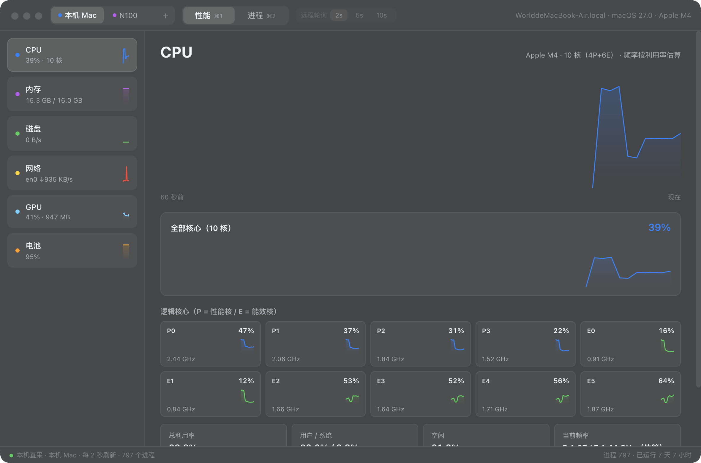
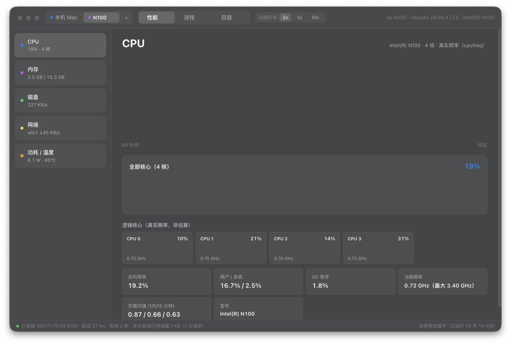
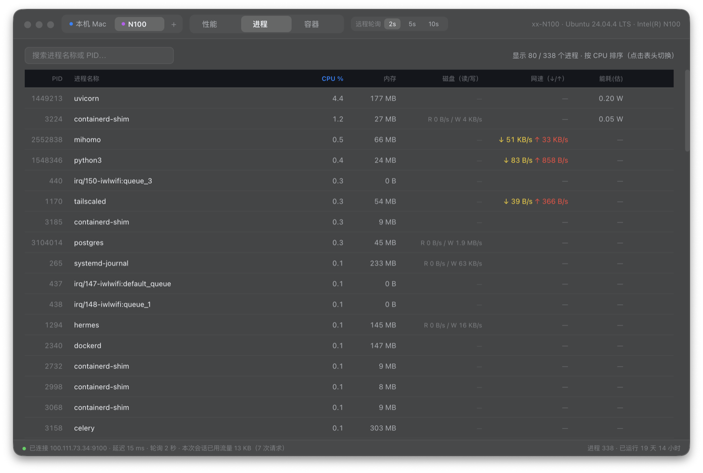
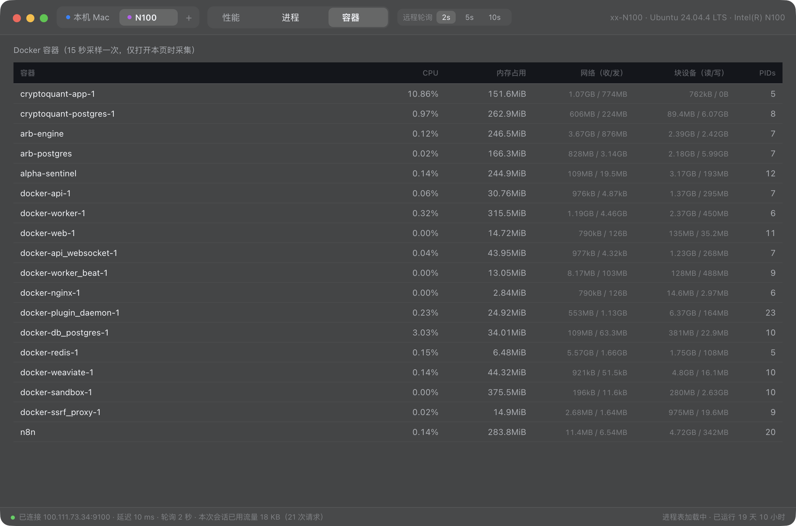

# 任务管理器-统一版

一个 macOS App，同时监控**本机 Mac** 与**远程 Linux 主机**（N100 等）——整合自 [mac-task-manager](https://github.com/zsan189312-sys/mac-task-manager)（本机版）与 [mac-task-manager-n100](https://github.com/zsan189312-sys/mac-task-manager-n100)（远程版），两个原项目保持独立可用。

## 下载（免编译）

👉 [Releases 页 → v1.0.1](https://github.com/zsan189312-sys/mac-task-manager-unified/releases/tag/v1.0.1)

下载 `TaskManager-Unified-v1.0.1-macOS-arm64.zip`（103 MB，Apple Silicon / M 系列），解压后把「任务管理器-统一版.app」拖进「应用程序」，**首次打开需右键 → 打开**（未做 Apple 公证，右键打开一次后即可正常双击）。

SHA256：`82f4785e8ca91066386cc645539deecdd6bc9b149e78c8ff55dc38c6030fd96a`

## 预览

| 本机 Mac（性能页） | 远程 N100（性能页） |
|---|---|
|  |  |

左：P/E 核分离十核图块、内存、磁盘、网络、GPU、电池。右：4 核真实频率、RAPL 实时功耗与温度。

## 特性

**双数据源，一键切换**（顶栏主机切换器，支持添加/移除多台远程主机）：

| | 本机 Mac | 远程 Linux（N100 等） |
|---|---|---|
| 采集方式 | Swift 助手 + 系统命令直采 | 常驻 agent（HTTP + gzip） |
| 刷新 | 固定 2 秒 | 2s / 5s / 10s 可调（省流量） |
| CPU | 每核占用 + P/E 核分组 + 估算频率 | 每核占用 + 真实频率（cpufreq） |
| 独有面板 | GPU（IOAccelerator）、电池（电压/电流/功率/健康度） | RAPL 真实功耗、温度、Docker 容器 |

**进程页**（两台主机统一七列）：CPU（占整机 %）、内存、磁盘读/写、网速 ↓/↑、能耗瓦数、远程/本地结束进程。macOS 侧已适配 macOS 27 的坑：KERN_PROC_ALL 全量枚举 + darwinbg/nice 线程 CPU 归属修复（kernel_task 与受保护系统进程聚合补齐）。



**容器页**（远程主机）：Docker 容器 CPU / 内存 / 网络 / 块设备 / PIDs，仅在打开本页时采样。



**省流量设计**：快照 gzip 后约 1.8 KB/次；进程表与容器数据仅在对应页打开时采集；状态栏实时显示延迟与本次会话流量。5 秒轮询挂机 24 小时约 30 MB。

## 构建

```bash
cd app && ./build.sh   # 需 macOS + swiftc + Node 22+，自动编译助手/图标/打包/签名/安装
```

## 远程主机部署

在目标 Linux 机上部署 agent（Python 标准库零依赖，详见 [mac-task-manager-n100](https://github.com/zsan189312-sys/mac-task-manager-n100)）：

```bash
scp agent/n100_agent.py root@目标机:/opt/n100-agent/
scp agent/n100-agent.service root@目标机:/etc/systemd/system/
ssh root@目标机 "systemctl daemon-reload && systemctl enable --now n100-agent"
```

agent 默认绑定 `0.0.0.0:9100`（建议防火墙限制来源），root 运行以读取 RAPL 功耗与全部进程磁盘 I/O。App 顶栏「+」填入 IP 与端口即可接入。

## 结构

```
app/
  main.js         # 主进程：本机采集 + 远程 HTTP 双数据源、多主机管理、轮询
  renderer.js     # 统一渲染：动态卡片（GPU/电池/功耗按可用性显示）
  index.html      # macOS 毛玻璃 UI、主机切换器
  preload.js      # contextBridge
  cpucores.swift  # Mach API 每核 CPU tick（macOS 27 移除了 kern.cp_time）
  procinfo.swift  # KERN_PROC_ALL + PROC_PIDTASKINFO/rusage 进程采集
  icon.swift      # 程序化图标（紫蓝配色 + 双机指示点）
  build.sh        # 一键构建
agent/            # 指向 mac-task-manager-n100 的部署脚本（同源）
```

## 已知口径说明

- 本机 CPU 频率为估算（Apple Silicon 无用户态频率接口）：`基础频率 + 利用率 × (睿频 − 基础)`，P 核 ≤ 4.41 GHz / E 核 ~2.6 GHz
- 本机磁盘吞吐 macOS iostat 不区分读/写，显示为合计；远程主机为真实读/写差分
- 能耗：本机 = 整机份额 × 20W 估算；远程 = 真实 RAPL 封装功耗 × CPU 份额
